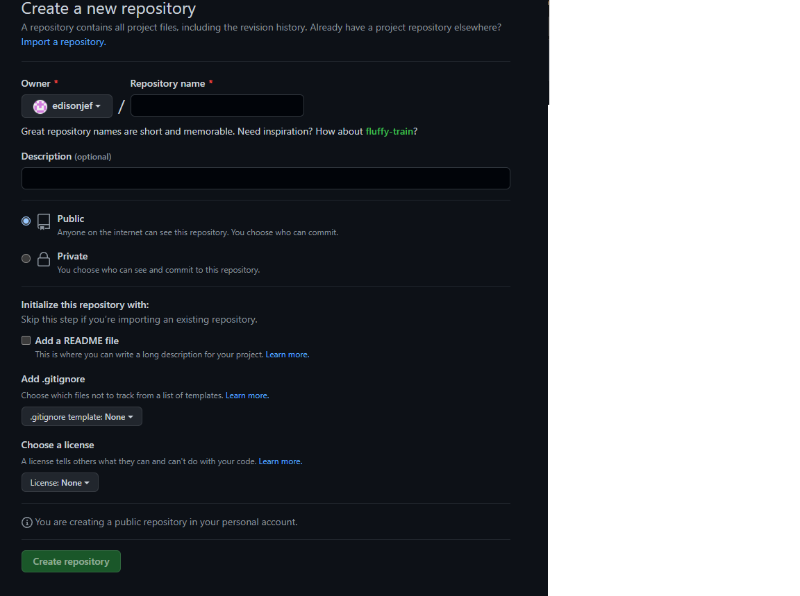

# Clase 03
## crear repositorio en GitHub


### Si el repositorio no esta creado
…or create a new repository on the command line
echo "# nombre-repo" >> README.md
```
git init
git add README.md
git commit -m "first commit"
git branch -M main
git remote add origin https://github.com/mlapeducacionit/nombre-repo.git
git push -u origin main
```
### Si el repo local esta creado

…or push an existing repository from the command line
```
git remote add origin https://github.com/mlapeducacionit/nombre-repo.git
git branch -M main # No es necesario
git push -u origin main
```
### GIT REMOTE
* Si quiero saber si tengo un remoto
```
git remote
```

* Más detalle sobre los remotos
```
git remote -v
```
* Para agregar un remoto

```
git remote add <alias> <url-del-remoto>
```

Para quitar un remoto
```
git remote remove <alias>
git remote remove origin
```
* Si quiero subir al repositorio remoto el local

La primera vez
```
git push -u <alias-del-remoto> <rama-local-que-quiero-subir>
git push -u origin main
```
Las siguientes veces que quiera subir
```
git push
```